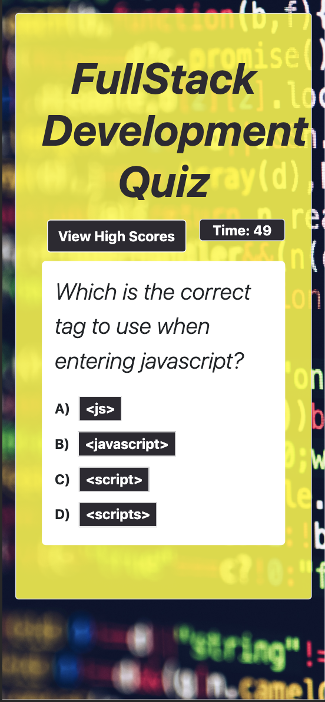

# JT Turner's Code Quiz

##Links to deployed application
Github Pages: https://github.com/javierturner/codequiz
Deployed Application: https://javierturner.github.io/codequiz/index.html#

##Installation

There is no installation required for this project.

##Usage

The purpose of this was to demonstrate my understanding of local storage along with other JavaScript fundamentals, such as methods to select elements (getElementById, querySelector, etc.), adding event listeners, setting functions to move through arrays within an object. 

##Functionality
This website functions by giving the user a dialog box explaining the rules to the quiz. Once they click "Start," they will be given 75 seconds to answer 5 questions. If they choose the wrong answer, they will be penalized by losing 5 points/seconds; if they choose the right answer, they will be awarded 10 points/seconds. Once the quiz is complete or they run out of time, they are then prompted to enter their name, which is then stored into local storage along with their score. 

There is also a button for viewing high scores, which will take them directly to the high scores page.

##Credits

° https://www.w3schools.com/jsref/prop_win_localstorage.asp
° https://www.w3schools.com/jsref/met_win_setinterval.asp
° https://youtu.be/LQGTb112N_c
° https://youtu.be/riDzcEQbX6k

##Screenshots of completed application

##License

MIT License

Copyright (c) 2019 Javier Turner

Permission is hereby granted, free of charge, to any person obtaining a copy
of this software and associated documentation files (the "Software"), to deal
in the Software without restriction, including without limitation the rights
to use, copy, modify, merge, publish, distribute, sublicense, and/or sell
copies of the Software, and to permit persons to whom the Software is
furnished to do so, subject to the following conditions:

The above copyright notice and this permission notice shall be included in all
copies or substantial portions of the Software.

THE SOFTWARE IS PROVIDED "AS IS", WITHOUT WARRANTY OF ANY KIND, EXPRESS OR
IMPLIED, INCLUDING BUT NOT LIMITED TO THE WARRANTIES OF MERCHANTABILITY,
FITNESS FOR A PARTICULAR PURPOSE AND NONINFRINGEMENT. IN NO EVENT SHALL THE
AUTHORS OR COPYRIGHT HOLDERS BE LIABLE FOR ANY CLAIM, DAMAGES OR OTHER
LIABILITY, WHETHER IN AN ACTION OF CONTRACT, TORT OR OTHERWISE, ARISING FROM,
OUT OF OR IN CONNECTION WITH THE SOFTWARE OR THE USE OR OTHER DEALINGS IN THE
SOFTWARE.